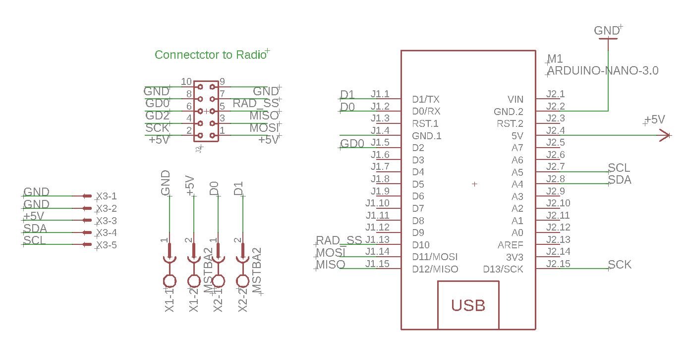
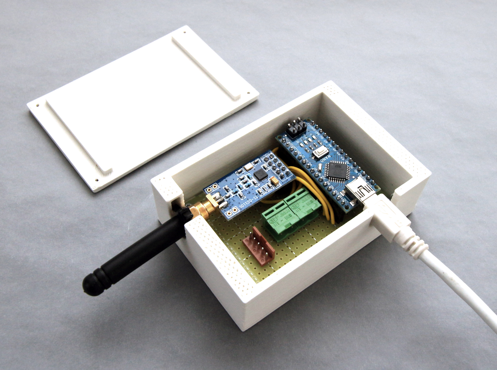
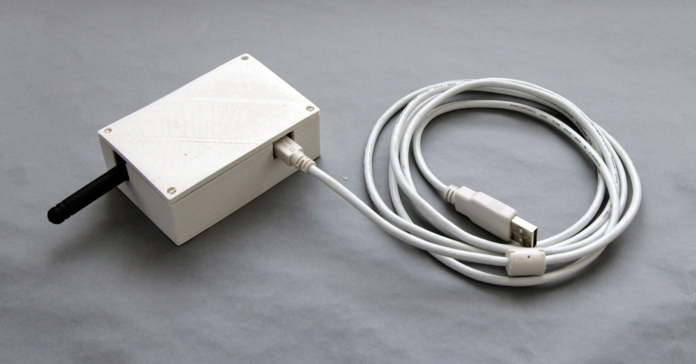

# 00 USB Radio Dongle

This is a USB to CC1101 Radio dongle. 

[Details of CC1101 Radio Module and it's available frequency, mode and settings](../doc/radio/CC1101_Radio.md)

## Design Goals

This clamp controller can achieve the following goal (with proper firmware):

- Allow a PC to connect to it via USB. 
- Allow the PC to configure the CC1101 settings via the USB (address, frequency, channel and sync word)
- Allow the PC to send and receive variable length message packet via the USB
- Allow debug messages to be printed to a 1602 LCD Screen (via I2C bus with the PCF9574 IO Expander)

This radio is intended to be use as a **modular building block** for the network of remote-controlled clamps. It can be used on the master mode (PC) and the slave nodes (e.g. [01_SerialController](..\01_SerialController\01_SerialController.md)). However, later slave node controller (e.g. [02_RadioPIDController](..\02_RadioPIDController\02_RadioPIDController.md)) have integrated the radio control directly on the controller MCU, omitting the need for this dongle, saving an Arduino Nano and space. 

## Component choice

**Radio Choice:** [CC1101 Module](../doc/radio/CC1101_Radio.md)

**MCU Choice:** Arduino Nano (ATMEGA328 with new bootloader)

**Power:** Powered by host computer USB Port @ 5V

**Connector to 01 Serial Radio :** Phoenix Terminal Block Socket 5.08mm Pitch

**Connector to IC LCD Screen:** Reichelt PS Series 2.5mm Pitch 5 Pin PCB Connector (PS25/5G BR)  

## Schematic

[Original Eagle Schematic File](Dongle.sch)

## Board

This board is built on a 50mm x 70mm **protoboard**. The wiring is mainly completed using small wires. Arrangement of the components can refer to the photo below. The schematic drawing is also drawn with the connectors oriented the same as in the PCB.

## Photo

The Arduino Nano and CC1101 radio module can be seen. Mounted to a plastic case.

------

Radio with case cover closed.

## Firmware

Please see the serial_radio section in the [clamp_firmware repo](https://github.com/gramaziokohler/clamp_firmware).

## Arduino Pin Assignment

To the CC1101 radio module

| Radio Pin | Arduino Pin | Note                       |
| --------- | ----------- | -------------------------- |
| 5V+       | 5V+         |                            |
| GND       | GND         |                            |
| CSN       | D10         | Radio Slave Select         |
| MOSI      | D11         | MOSI Data                  |
| MISO      | D12         | MISO Data                  |
| SCK       | D13         | Serial Clock               |
| GD0       | D2          | Message Arrival Indication |

------

To the dubug LCD screen

| LCD Screen Pin | Arduino Pin | Note         |
| -------------- | ----------- | ------------ |
| Vcc            | 5V+         |              |
| GND            | GND         |              |
| SDA            | A4          | Serial Data  |
| SCL            | A5          | Serial Clock |

