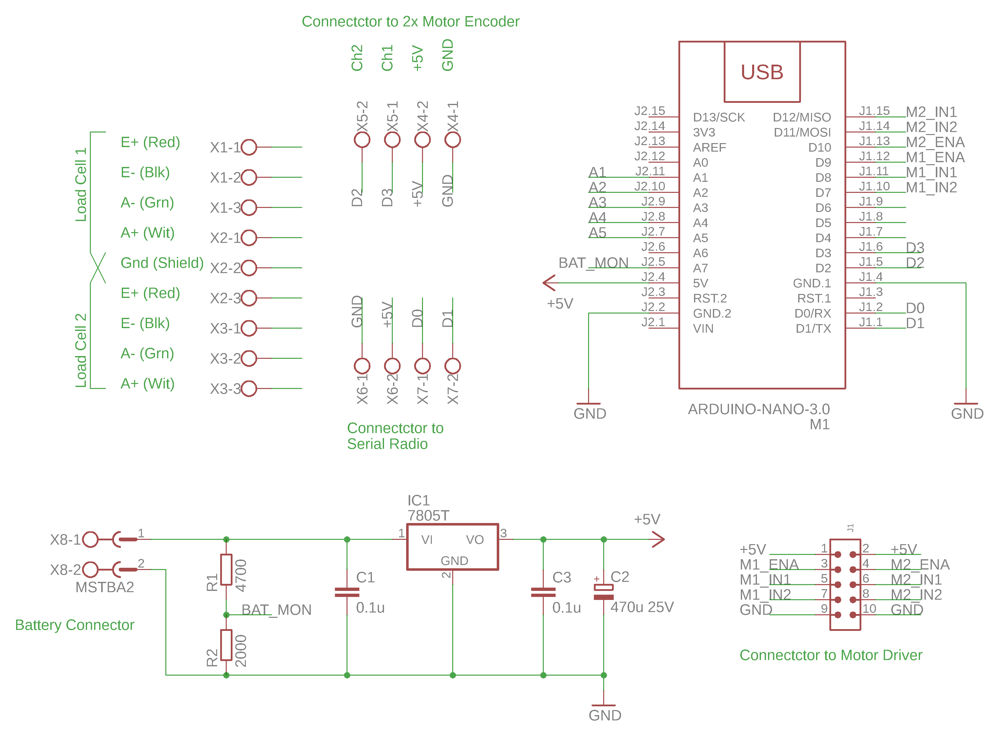
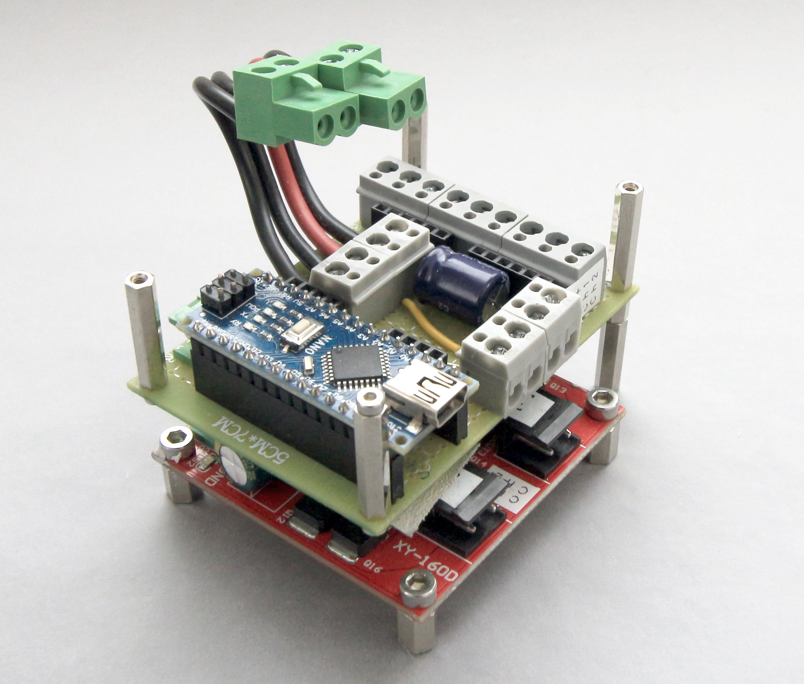

# 01 Serial Controller

## Design Goals

This clamp controller can achieve the following goal (with proper firmware):

- Control and communicate through serial interface. 
  - From computer via **CH340 USB chip** on Arduino Nano
  - From Radio via **TX RX interface** with [USB Radio Dongle](../00_USBRadioDongle/00_USBRadioDongle.md)
- Control 1 or 2 motors for the clamp's main linear movement
  - PWM / Bidirectional output via XY160D driver to two DC motors
  - Close loop feedback from single-phase hall effect shaft encoder from 2 motors
- Operate on 3 or 4-cell Li-Po Battery power
- Monitor battery voltage

## Component choice

**Battery Choice:** Up to user (typical: 4-cell Li-Po 1000mAh 4S 75C)

**Radio Choice:** [00_USBRadioDongle](../00_USBRadioDongle/00_USBRadioDongle.md)

**Radio Interface:** TX RX Interface with 5V power

**Motor Driver Choice:** [Motor Driver XY160D](../doc/motor_driver/motor_driver_XY160D.md)

**Load Cell Interface:** [HX711 AD Module](../doc/load_cell/load_cell.md)

**Load Cell Choice:** Up to user (any 4 wire load cell)

**MCU Choice:** Arduino Nano (ATMEGA328 with new bootloader)

**Voltage Regulation:** Single stage LM7805 solution (see schematic)

**End Switch Choice:** No end switch is connected. (end position inferred by software)

## Schematic

[Eagle Schematic File](SerialController.sch)

## Photo

## Test Notes

A simple test was performed to determine if the encoder has good repeatability. 

Result: Single-phase encoder is not reliable for bi-directional positional control. 

Inferring rotational direction is not reliable and result in poor axis repeatability.