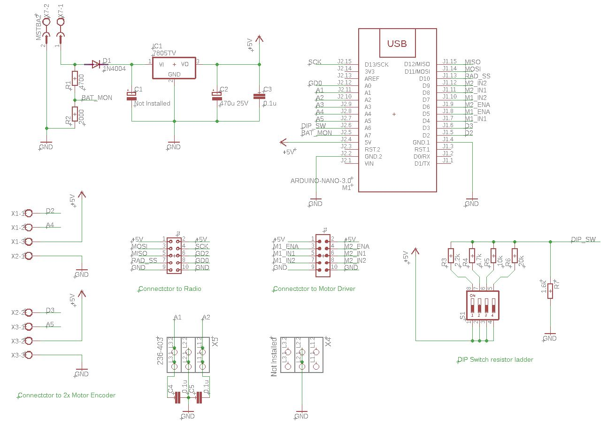
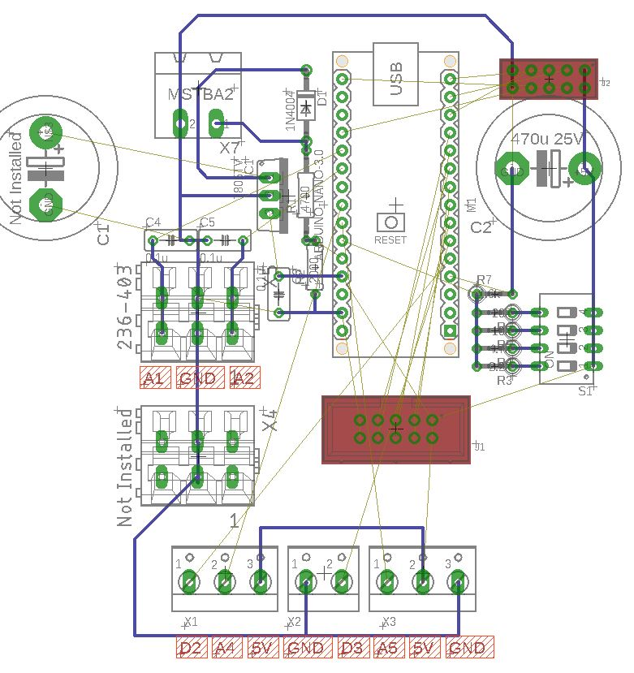

# 02 Radio PID Controller

This controller is put together in a rush for project Tokyo. Some components are drawn here, but not installed due to lack of on-hand components.

## Design Goals

This clamp controller can achieve the following goal (with proper firmware):

- Control and communicate through CC1101 radio module. (SPI)
- Control 1 or 2 motors for the clamp's main linear movement
  - PWM / Bidirectional output via XY160D driver to two DC motors
  - Close loop feedback from two-phase hall effect shaft encoder from 2 motors
- Operate on 3 or 4-cell Li-Po Battery power
- Monitor end / homing switch
- Monitor battery voltage
- Output for a LED status light or buzzer 

## Component choice

**Battery Choice:** Up to user (typical: 4-cell Li-Po 1000mAh 4S 75C)

**Radio Choice:** [CC1101 Module](../doc/radio/CC1101_Radio.md)

**Motor Driver Choice:** [Motor Driver XY160D](../doc/motor_driver/motor_driver_XY160D.md)

**MCU Choice:** Arduino Nano (ATMEGA328 with new bootloader)

**Voltage Regulation:** Single stage LM7805 solution (see schematic)

**Addressing / Settings DIP Switch:** 4 position DIP switch with resistor ladder

## Schematic

[Original Eagle Schematic File](Controller.sch)

## Board

This board is built on **protoboard**, the following board shows mostly the hard wiring underneath the protoboard. There are jumpers that routes from top side not drawn here.

[Original Eagle Board File](Controller.brd)

## Arduino Pin Assignment

The following header file can be used for pin assignment

