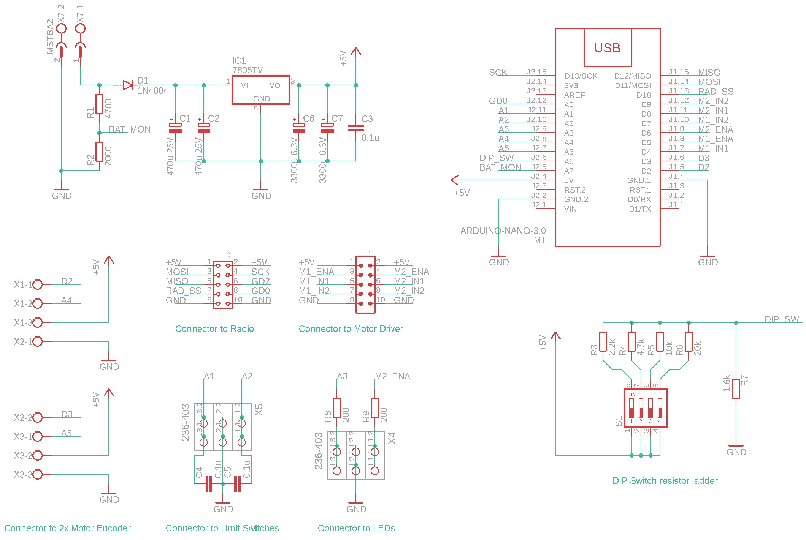
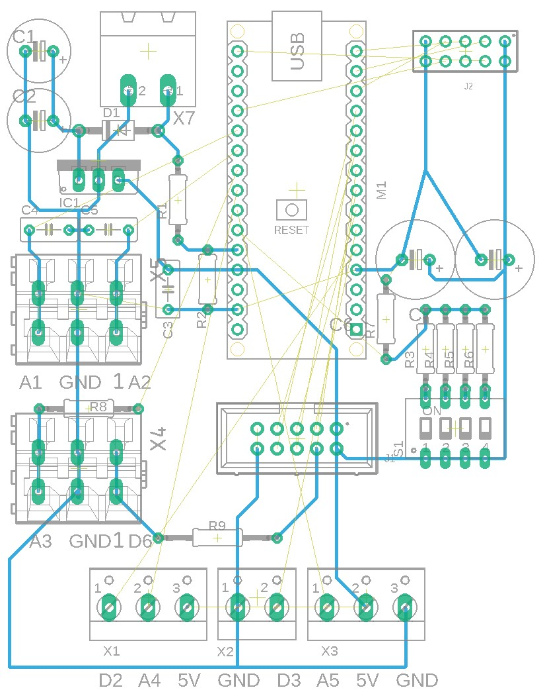

# 03 Radio PID Controller V2

This controller is an upgrade of 02_Radio_PID_Controller and retains most of the design features of the previous controller with the following modifications:

- 5V power regulation is improved 
- LED connections and resistors are integrated
- Some bottom routing is redesigned for easier soldering.

## Design Goals

This clamp controller can achieve the following goal (with proper firmware):

- Control and communicate through CC1101 radio module. (SPI)
- Control 1 or 2 motors for the clamp's main linear movement
  - PWM / Bidirectional output via XY160D driver to two DC motors
  - Close loop feedback from two-phase hall effect shaft encoder from 2 motors
- Operate on 3 or 4-cell Li-Po Battery power
- Monitor homing switch / pneumatic autoswitch
- Monitor battery voltage
- Output for 1 or 2 LED status light

## Component choice

**Battery Choice:** Up to user (typical: 4-cell Li-Po 1000mAh 4S 75C)

**Radio Choice:** [CC1101 Module](../doc/radio/CC1101_Radio.md)

**Motor Driver Choice:** [Motor Driver XY160D](../doc/motor_driver/motor_driver_XY160D.md)

**MCU Choice:** Arduino Nano (ATMEGA328 with new bootloader)

**Voltage Regulation:** Single stage LM7805 solution (see schematic)

**Addressing / Settings DIP Switch:** 4 position DIP switch with resistor ladder

**End Switch Choice:** Normal close (NC) switch

## Schematic

[Eagle Schematic File](Controller.sch)

## Board

This board is built on **protoboard**, the following board shows mostly the hard wiring underneath the protoboard. There are jumpers that routes from top side not drawn here.

[Eagle Board File](Controller.brd)

## Photo

The Controller in enclosed case with plugged in battery. The disconnected cables goes to DC motor with encoder.

------

Arduino Nano and radio module (Blue PCB with antenna) on protoboard. The Motor driver (red PCB) can be  seen below the protoboard. 

## Arduino Pin Assignment

|                               | 1 motor operation | 2 motor operation   |
| ----------------------------- | ----------------- | ------------------- |
| Homing Switch                 | 1 switch (A1)     | 2 switches (A1, A2) |
| Gripper Autoswitch            | 1 input (A2)      | not available       |
| Motor Encoder 1               | interrupt (D2)    | interrupt (D2, D3)  |
| Motor Encoder 2               | interrupt (D3)    | gpio (A4, A5)       |
| Motor Status LED (orange/red) | D6                | not available       |

