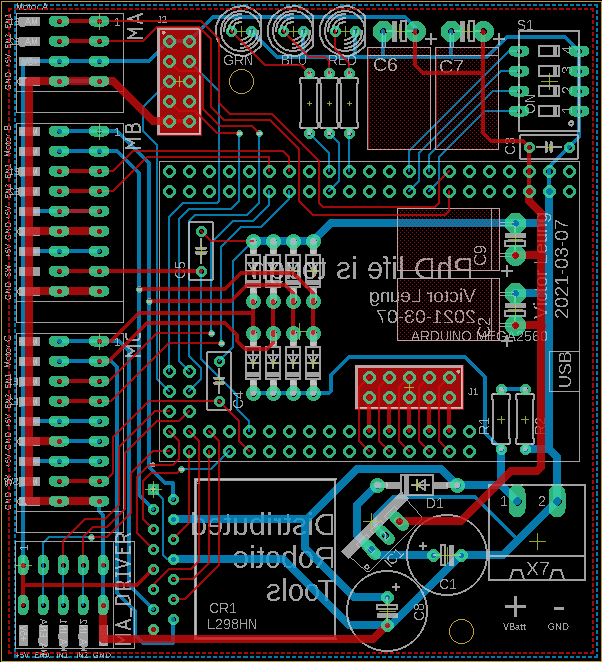

# 04 Radio PID Controller V3

This controller is an upgrade of 03_Radio_PID_Controller and retains most of the design features of the previous controller with the following modifications:

- Arduino Mega 2560 PRO from robotdyn
- 1 channel Main Motor Control
- 2 channels Motor Control for gripper motors
- PCB base instead of hand-soldered 

## Design Goals

This clamp controller can achieve the following goal (with proper firmware):

- Control and communicate through CC1101 radio module. (SPI)
- Control 3 motors, 1 for the clamp's main linear movement, 2 for clamp gripper actuation
  - PWM / Bidirectional output via XY160D driver to two DC motors
  - Close loop feedback from two-phase hall effect shaft encoder from 2 motors
  - Main motor and gripper motor not not operate simultaneously. 
- Operate on 3 or 4-cell Li-Po Battery power
- Monitor homing switch / pneumatic autoswitch
- Monitor battery voltage
- Output for 1 or 2 LED status light

## Component choice

**Battery Choice:** Up to user (typical: 4-cell Li-Po 1600mAh 4S 75C)

**Radio Choice:** [CC1101 Module](../doc/radio/CC1101_Radio.md)

**Motor Driver (Main Screw Motor) Choice:** H-Bridge Motor Driver JZ3615 (15A continuous, 50A peak)

**Motor Driver (Pin Gripper Motor) Choice:** [H-Bridge Motor Driver L298HN](https://www.sparkfun.com/datasheets/Robotics/L298_H_Bridge.pdf) (Total 4A continuous)

**MCU Choice:** Arduino Nano (ATMEGA328 with new bootloader)

**Voltage Regulation:** Single stage LM7805 solution (see schematic)

**Addressing / Settings DIP Switch:** 4 position DIP switch with resistor ladder

**End Switch Choice:** Normal close (NC) switch

## Schematic

[Eagle Schematic File](Controller.sch)

## Board

This board is built by PCB fab company in China, the following drawing shows bottom side (blue) and top side (red).

[Eagle Board File](Controller.brd)

## Errata

- **BAT_MON** net should be connected to an Analog Pin on the MCU, but was not connected. This is rectified by jumper wire from trace between R1 R2 to J1 Pin **A3**.
-  **GD0** net (radio message arrive flag) should be connected to a pin on the MCU, but was not connected. This is rectified by jumper wire from J2 GD0 pin to J1 Pin **A2**.
-  Two buttons are added for manually controlling the grippers, they are wired to A96 A10 A11 

## Photo

The Controller in enclosed case with all cables connected.

------

## Arduino Pin Assignment

|                 | MA (Screw Motor)       | MB (Gripper Motor)      | MC (Gripper Motor)      |
| --------------- | ---------------------- | ----------------------- | ----------------------- |
| Motor IN1       | MA_IN1 (D48)           | MB_IN1 (D40)            | MC_IN1 (D42)            |
| Motor IN2       | MA_IN2 (D49)           | MB_IN2 (D47)            | MC_IN2 (D43)            |
| Motor Enable    | MA_ENA (D46)           | MB_ENA (D44)            | MC_ENA (D45)            |
| Motor Encoder 1 | MA_E1 (D2) interrupt 4 | MB_E1 (D19) interrupt 2 | MC_E1 (D20) interrupt 1 |
| Motor Encoder 2 | MA_E2 (D3) interrupt 5 | MB_E2 (D21) interrupt 0 | MC_E2 (D18) interrupt 3 |
| Homing Switch   | nil                    | MB_SW (D39)             | MC_SW(D38)              |
