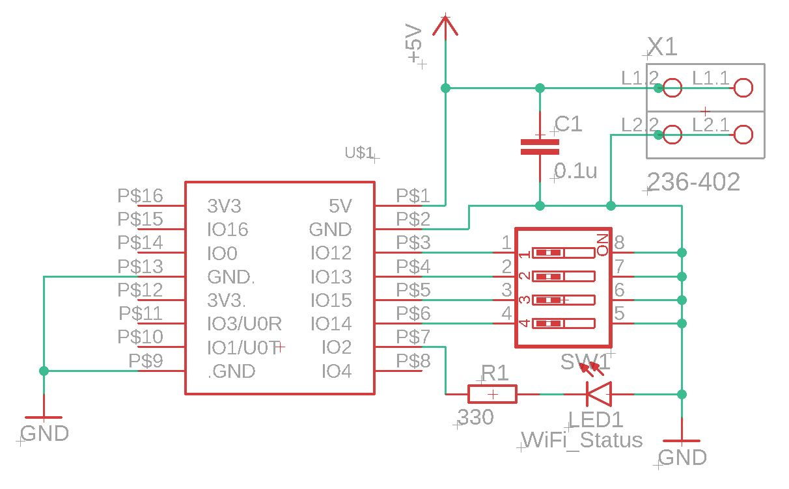
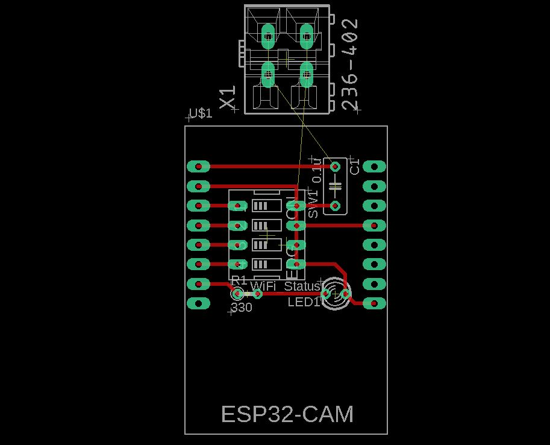

# 10_ESP32CAMAdapter

This an adapter board for connecting AIThinker ESP32-CAM module.

The Camera Module draws power from the stabilized 5V supply of the Clamp controller. It does not communicate directly with the clamp controller. 

- A DIP switch is used to set the IP address of the Controller. 
- A Status LED indicates successful connection with the Wi-Fi Access Point.

The board is implemented on protoboard. The wire terminal is not present and is replaced with a directly soldered wire. The board have to be removed during programming. 

