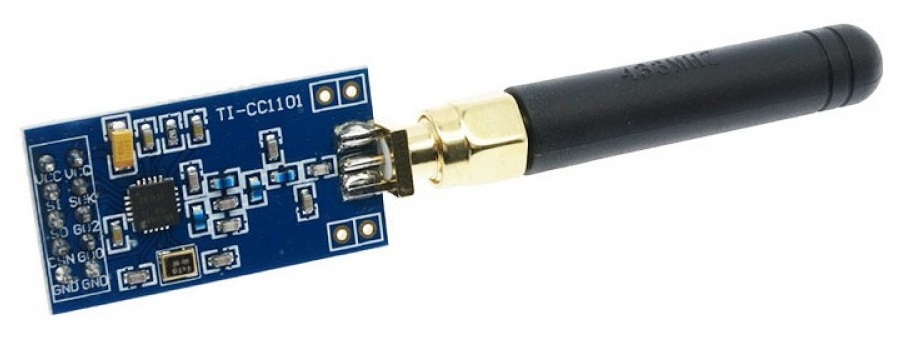
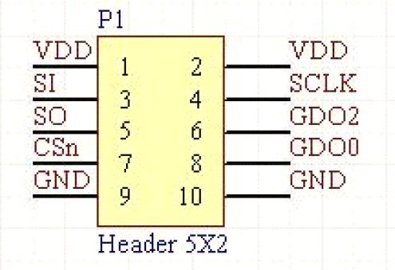

# CC1101 Radio Module

CC1101 is a [Low-power Sub-1 GHz wireless transceiver from Texas Instruments](http://www.ti.com/product/CC1101). 

> CC1101 is a low-cost sub-1 GHz transceiver designed for very low-power wireless applications. The circuit is mainly intended for the ISM (Industrial, Scientific and Medical) and SRD (Short Range Device) frequency bands at 315, 433, 868, and 915 MHz, but can easily be programmed for operation at other frequencies in the 300-348 MHz, 387-464 MHz and 779-928 MHz bands.
>
> The RF transceiver is integrated with a highly configurable baseband modem. The modem supports various modulation formats and has a configurable data rate up to 600 kbps.
>
> CC1101 provides extensive hardware support for packet handling, data buffering, burst transmissions, clear channel assessment, link quality indication, and wake-on-radio.
>
> The main operating parameters and the 64- byte transmit/receive FIFOs of CC1101 can be controlled via an SPI interface. In a typical system, the CC1101 will be used together with a microcontroller and a few additional passive components.
>
> The CC1190 850-950 MHz range extender [21] can be used with CC1101 in long range applications for improved sensitivity and higher output power.

There are many CC1101 modules from various manufacturers that have integrated peripheral components (mostly SMD) into a THT package with 2.54 pin spacing. 

I choose to use this particular version because it is available to me via Telesky Taobao shop. Other models may also work with some pin adaptation.

The Pin out of the 

## Spec Sheet

[CC1101 Texas Instrument Datasheet](CC1101.pdf)

[CC1101 Module by Elechouse Datasheet](cc1101module_elechouse.pdf)

[CC1101 Module by SecuriPi Datasheet](cc1101module_securipi.pdf)

## Pinout Connection

Note: SI, SO, CSn, SCLK pins are part of the SPI bus and should be connected to the Arduino Hardware SPI pins. On the Nano, the pins assignments are as follows:

| CC1101 Module Designation | Arduino Designation | Arduino Pin Number |
| ------------------------- | ------------------- | ------------------ |
| SI                        | MOSI                | D11                |
| SO                        | MISO                | D12                |
| CSn                       | SS                  | D10                |
| SCLK                      | SCK                 | D13                |

GDO0 can be used for detecting incoming packages. It can be connected to any GPIO on Arduino.

## Voltage

In various documentation I have found (Including the official TI1101 doc and various module manufacturer). **The Vcc voltage is recommended to be 3.3V.**

However, I simply have no luck running the module at 3.3V from the Arduino. 

The Arduino 3.3V should provide 50mA and that should be enough current for the CC1101 at about 35mA max draw (at TX max power). I tried using 5V for Vcc and it all worked fine. So **I'm using 5V** now without investigating further.

I'm not sure if this particular module incorporated a regulator on board, does not look like so (from reading the SMD components because detailed schematic of the module is not found). 

All the other pins (SPI and SDO pins) are documented to be 5V tolerant and they can be directly connected to Arduino.

## Software Libraries

Further details of software is documented in the firmware repo.

https://github.com/pkarsy/mCC1101

https://github.com/pkarsy/CC1101_RF