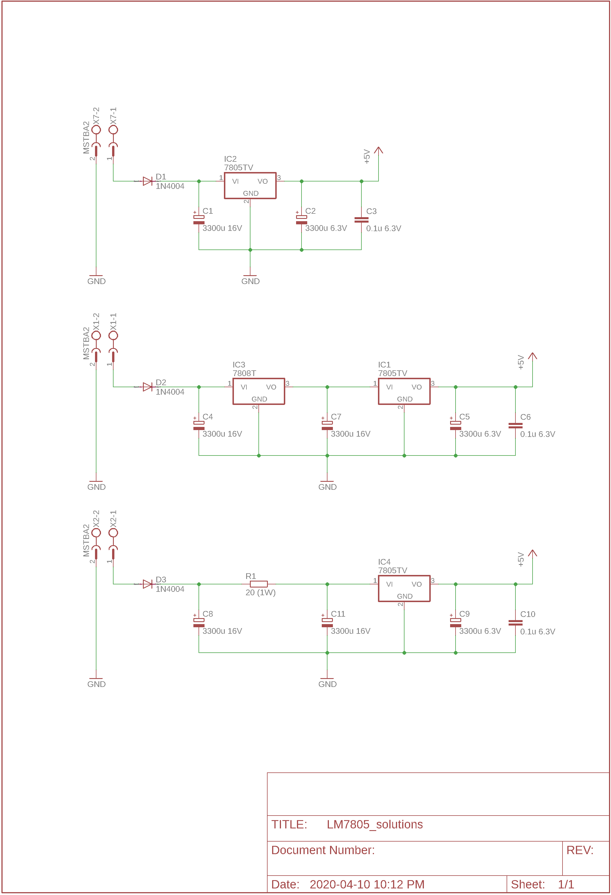

# Battery Voltage Regulation for Controller

The fluctuating battery voltage for a 4-cell Li-Po is between 12.8V to 16.8V. This needs to be regulated to stable 5V DC for the digital circuitry.

## Calculation

**Max Input Voltage :** 16.8V
**Max Voltage Drop:** 16.8V -  5V = **11.8V**
**Current draw** is expected/measured to be about **0.2A**
**Max Power Dissipation:** 0.2 * 11.8V = **2.36W**

Although linear regulation is not efficient, LM78 series is ease and compact to use. Use TO-220 package for optimal heat dissipation. 

[LM7805CT (TO-220) Spec PDF](http://www.ti.com/lit/ds/symlink/lm340.pdf)

## Anti backflow diode

A diode is placed between the battery input and the regulator circuit. This prevents instantaneous high current draw from the motor driver to drain the first buffering capacitor. This design can can only avoid short power disruption.

Assuming a 0.2A current draw, an interruption of 0.1sec will demand the buffering capacitor to deliver **0.02C charge**.

Lowest Voltage at Capacitor is 14.8 when battery is about to go empty. The minimum input voltage of 7805 is 7V. Therefore the capacitor need to have a capacitor of 0.02C / (14.8-7V) = **2564 μF**

A **3300 μF capacitor** will be reasonable.

The assumption of 0.1s interruption is not tested, real application may have longer interruption. 

## Three linear regulation solutions below

Single stage LM7805 is the simplest, but heat is concentrated on one device and noise filtering may not be ideal.

Two stage LM7808 + LM7805 to share heat and better noise decoupling.

Two stage RC Buffer + LM7805 for simple design yet still provide better noise decoupling. The 20 Ohm resistor will dissipate about 0.8W (0.2A * 4V drop) of heat.

